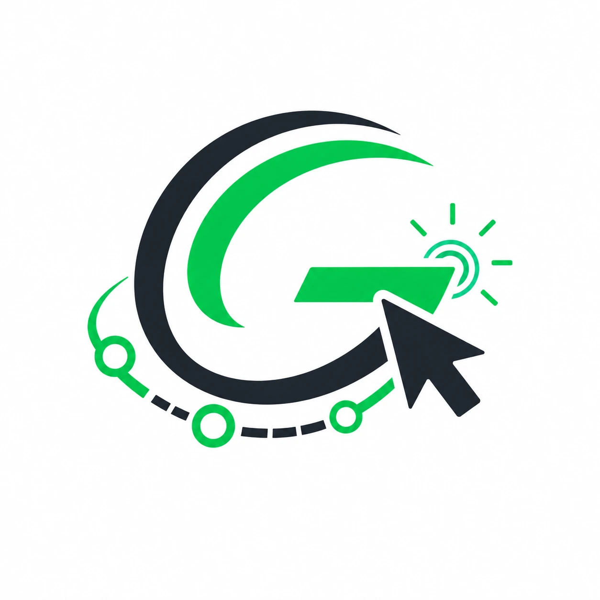

<p align="center">
  
</p>

<h1 align="center">gsap-choreography</h1>

AI coding instructions for building scripted, multi-scene GSAP product animations — the kind of hero section you see on Linear, Milanote, and Stripe, where a fake cursor walks through the product while scenes transition on a choreographed timeline.

No one teaches this. Plenty of GSAP tutorials cover tweens and scroll triggers. None cover the orchestration layer: how to coordinate a cursor, click feedback, scene transitions, typed text, nav state, layout morphing, and multi-cursor collaboration into a single looping timeline that feels like a directed film.

This repo packages that knowledge as AI coding agent instructions. One skill, every platform.

https://github.com/user-attachments/assets/0feb2bd5-3183-4345-abeb-b3a0641ba834

## What's inside

```
skills/gsap-choreography/
  SKILL.md                           ← Claude Code + Codex skill (full version)
  references/
    landing-animation.md             ← Choreography design doc (scenes, timing, coordinates)

AGENTS.md                            ← Codex agent instructions
.cursor/rules/gsap-choreography.mdc  ← Cursor rule (auto-triggers on animation files)
.github/instructions/                ← GitHub Copilot instructions
.windsurf/rules/                     ← Windsurf rule
plugin.json                          ← Claude Code plugin manifest
```

## Install

**Claude Code** (recommended — full skill with references):
```bash
claude plugin add github.com/Costumary/gsap-choreography
```

**Codex:** Clone into `.agents/skills/` or reference `AGENTS.md` at repo root.

**Cursor:** Copy `.cursor/rules/gsap-choreography.mdc` into your project's `.cursor/rules/`. Auto-triggers on files matching `*film*`, `*demo*`, `*animation*`, `*gsap*`, `*timeline*`.

**GitHub Copilot:** Copy `.github/instructions/gsap-choreography.instructions.md` into your project's `.github/instructions/`.

**Windsurf:** Copy `.windsurf/rules/gsap-choreography.md` into your project's `.windsurf/rules/`.

## What it teaches

| Pattern | What you get |
|---------|-------------|
| **Timeline as central authority** | One timeline, label-based positioning, no desync |
| **Cursor choreography** | Natural movement with spring physics, click squeeze + ripple feedback |
| **Scene transitions** | Cross-fading tabs, nav state updates, progress indicators |
| **Typed text** | Constant-speed character reveal with caret animation |
| **Click feedback system** | Cursor squeeze (0.88 scale) + ripple burst + `back.out(2.2)` overshoot |
| **Position measurement** | DOM-based `measure()` — never hardcode coordinates |
| **Stagger patterns** | Organic card placement, list reveals, timing guidelines |
| **Layout morphing** | Multi-property sidebar collapse with correct sequencing |
| **Multi-cursor collaboration** | Independent cursor paths on one timeline |
| **Animation manager** | React context for play/pause/restart coordination |
| **Responsive scaling** | Fixed design size + CSS transform scaling |
| **Accessibility** | `prefers-reduced-motion` with static fallback |

## Live example

[costumary.com](https://www.costumary.com) — the hero section runs a 4-scene, 26-second product walkthrough built entirely with these patterns. Pure DOM, no video, ~57kb total animation JS.

## Requirements

- GSAP 3.x + `@gsap/react` (free since Webflow acquisition, fall 2024)
- React 18+ with `useGSAP` hook
- Works with Next.js, Vite, or any React setup

## Why this exists

Every SaaS landing page wants a hero animation that walks through the product. The options are:

1. **Loom/video embed** — heavy, not interactive, can't match your design system
2. **Lottie/Rive** — requires a motion designer and a separate tool
3. **Hand-rolled GSAP** — powerful but no one shares the orchestration patterns

Option 3 is what Linear, Milanote, Stripe, and Vercel actually use. But the knowledge lives in agency codebases and senior frontend engineers' heads. You can't Google "how to build a scripted product demo animation with GSAP" and find anything beyond basic scroll-trigger tutorials.

This skill fills that gap. It's extracted from a production implementation and teaches the patterns that make the difference between a janky prototype and something that feels directed.

## License

MIT
